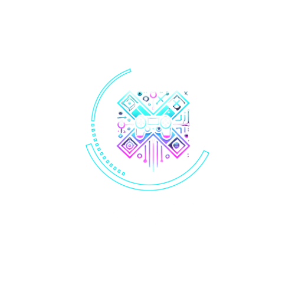

# 🎮 **JAVIX**  

  

O nome **“Javix”** foi escolhido por representar a combinação de **inovação** e **confiabilidade**.  
- **"Jav"** remete à palavra **Java**, uma referência à programação e tecnologia.  
- **"ix"** traz a ideia de algo **dinâmico** e **moderno**, simbolizando a **flexibilidade** e **adaptabilidade** da nossa empresa.  

Juntos, esses elementos refletem a missão da Javix de estar na **vanguarda tecnológica**, oferecendo **soluções inovadoras** e **eficientes** aos nossos clientes.

---

# 🤖 **PROJETO**
**1. Tela de Login**

• **Objetivo**: Criar uma tela onde o usuário insira um nome de
usuário e senha para acessar o sistema.  

**Funcionalidades:**

• O usuário insere as credenciais.

• Se as credenciais forem corretas, o usuário é redirecionado para a tela de menu, onde ele escolhe a calculadora ou o jogo da velha.

• Caso as credenciais estejam erradas, uma mensagem de erro é exibida.

**2. Calculadora**

• **Objetivo:** Criar uma calculadora simples que permita realizar
operações matemáticas básicas.  

**Funcionalidades:**

• O usuário pode inserir números e realizar operações como adição, subtração, multiplicação e divisão.

• O visor exibe o resultado final.

• O design da calculadora será simples, com botões para os
números e as operações.

**3. Jogo da Velha**

• **Objetivo:** Desenvolver o clássico jogo da velha para dois
jogadores.

**Funcionalidades:**

• O usuário escolhe entre jogar contra outro jogador ou contra
a máquina (dependendo da implementação).

• O jogo é exibido em uma grade 3x3, e os jogadores alternam
entre X e O.

• Ao final do jogo, o sistema identifica se houve vitória, empate
ou continuamento da partida.

• A interface deve ser intuitiva e permitir a fácil interação com
os botões para marcar as células da grade.

---

## 🌟 **MISSÃO**  
Desenvolver jogos e aplicativos inovadores que proporcionem **experiências imersivas** e emocionantes para os usuários, utilizando **tecnologia de ponta** e criatividade para transformar ideias em realidade.

---

## 💡 **VALORES**
- **🚀 Inovação**: Criatividade e novas soluções.  
- **🏅 Qualidade**: Compromisso com excelência.  
- **🤝 Colaboração**: Trabalho em equipe e respeito.  
- **🎉 Diversão**: Criar experiências que conectam e alegram.  
- **🌍 Responsabilidade**: Ética e respeito aos usuários.

---

## 🎯 **VISÃO**  
Ser reconhecida como uma **empresa líder** no desenvolvimento de jogos e aplicativos, promovendo **inovação constante** e criando **produtos que encantam** e conectam pessoas ao redor do mundo.

---
## 👩🏼‍🤝‍👨🏽 **EQUIPE JAVIX**

<table>
  <tbody>
    <tr>
      <td align="center"><a href="https://github.com/emillysoares05"> <b>Émilly Soares</b></a> </td>
      <td align="center"><a href="https://github.com/Ydvtim"> <b>Rayane Sousa</b></a> </td>
      <td align="center"><a href="https://github.com/willamesilvaof"> <b>Willame Silva</b></a> </td>
      <td align="center"><a href="https://github.com/Antonio-Andrew"> <b>Andrew Silva</b></a> </td>
    </tr>
  </tbody>
</table>

---

<h3 align="center">Fale Conosco:</h3>

  
  

